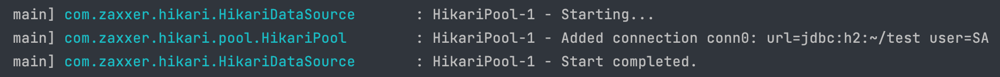
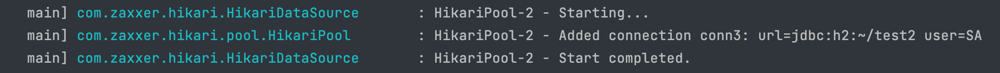

# Multiple-Databases
Spring boot with hikariCP and Multiple Databases

Multiple H2 Database

Java Cofing를 이용한 datasource 설정.

1. 데이터베이스 커넥션을 DB마다 각각 생성해야 함.(또는 스키마마다)
2. JPA EntityManagerFactory를 각각 데이터베이스마다 생성해야 함.(또는 스키마마다)
3. 엔티티를 각각의 데이터베이스 마다 구분해서 패키지를 만들고 2번에서 패키지 위치를 설정해야 함.

